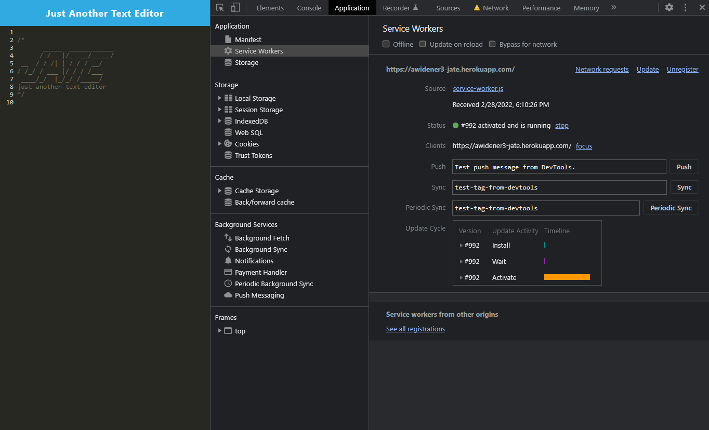
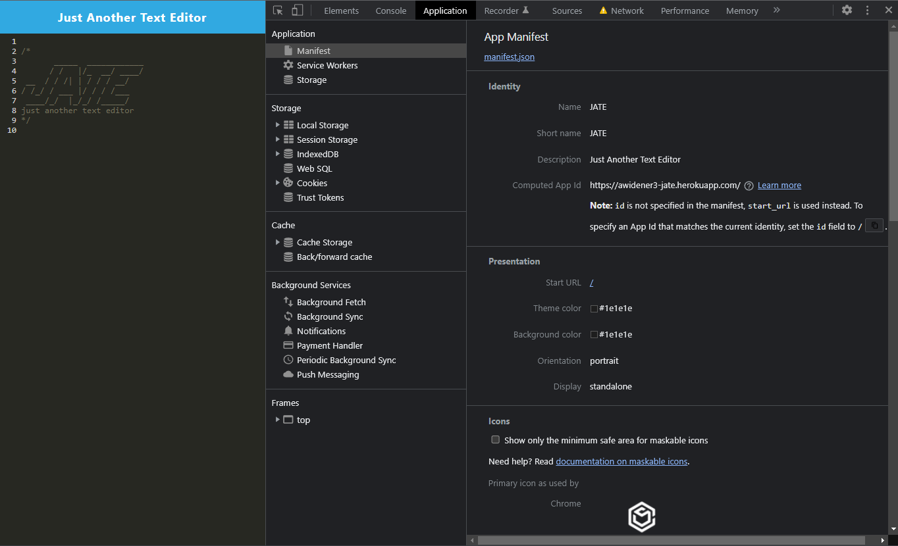
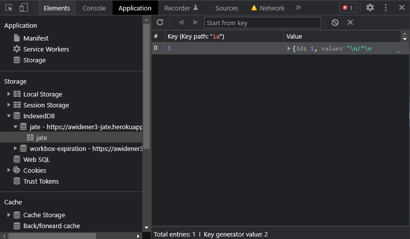
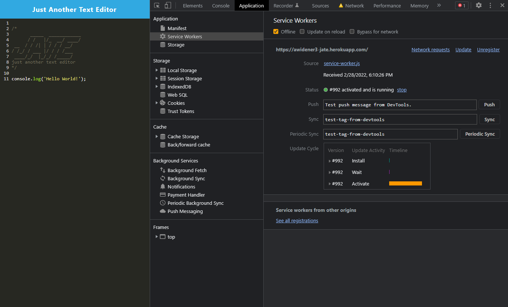

<p align="center">
  
</p>

# 📝 Homework #11: Text Editor (J.A.T.E.)

📌 [Link to Deployed Application](https://m19jate.herokuapp.com/)

## 🔨 Task
Create a text/code editor that functions on a single page, follows PWA criteria, and works offline. The application will also able to be downloaded onto your computer or mobile device to be used outside of the browser.

## 🧩 Tech Stack
- JavaScript
- [Webpack](https://webpack.js.org/)
  - Service Workers
  - Create Manifest
- [IndexedDB](https://developer.mozilla.org/en-US/docs/Web/API/IndexedDB_API)
- [Node.js](https://nodejs.org/en/)
- [Express](https://expressjs.com/)

## 📎 How to Use
Visit the [deployed application](https://m19jate.herokuapp.com/) where you will be presented with a code/text editor. Any code or text you add will save automatically whenever you click off of the window. On refresh or revisit, the text is persistent and saved in IndexedDB.


Using devtools, you can see both the Service Worker active, along with a loaded Manifest.





As you add and remove information, it is saved locally in IndexedDB



The app also works offline, thanks to the manifest and service worker



The app is able to be installed as a PWA onto your device (mobile or desktop) by pressing the install button on the top left, or the in-browser install button in the URL bar.


## 📷 Screenshots
The following screenshots follow the path of the preview video above, so you can take a closer look at the routes.

App in-browser


## User Story

```md
AS A developer
I WANT to create notes or code snippets with or without an internet connection
SO THAT I can reliably retrieve them for later use
```

## Acceptance Criteria

```md
GIVEN a text editor web application
WHEN I open my application in my editor
THEN I should see a client server folder structure
WHEN I run `npm run start` from the root directory
THEN I find that my application should start up the backend and serve the client
WHEN I run the text editor application from my terminal
THEN I find that my JavaScript files have been bundled using webpack
WHEN I run my webpack plugins
THEN I find that I have a generated HTML file, service worker, and a manifest file
WHEN I use next-gen JavaScript in my application
THEN I find that the text editor still functions in the browser without errors
WHEN I open the text editor
THEN I find that IndexedDB has immediately created a database storage
WHEN I enter content and subsequently click off of the DOM window
THEN I find that the content in the text editor has been saved with IndexedDB
WHEN I reopen the text editor after closing it
THEN I find that the content in the text editor has been retrieved from our IndexedDB
WHEN I click on the Install button
THEN I download my web application as an icon on my desktop
WHEN I load my web application
THEN I should have a registered service worker using workbox
WHEN I register a service worker
THEN I should have my static assets pre cached upon loading along with subsequent pages and static assets
WHEN I deploy to Heroku
THEN I should have proper build scripts for a webpack application
```
